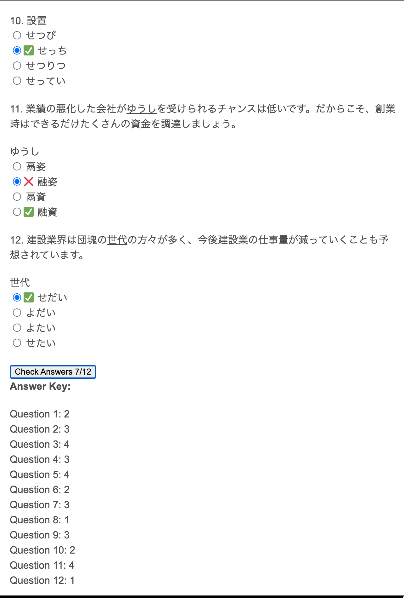

# jtest4you Answer Check

Have you ever used the [japanesetest4you.com](https://japanesetest4you.com/) website and found it cumbersome to have to to manually check your answers based on the answer key?
This is a simple chrome extension that automates that whole process. All it does is add a _Check Answers_ button next to the answer key, which when clicked, checks your answers for you.

# Demo

